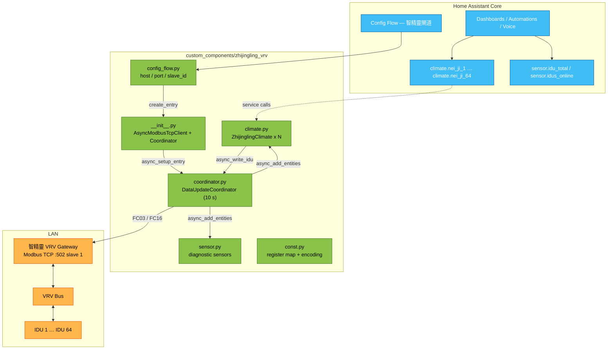
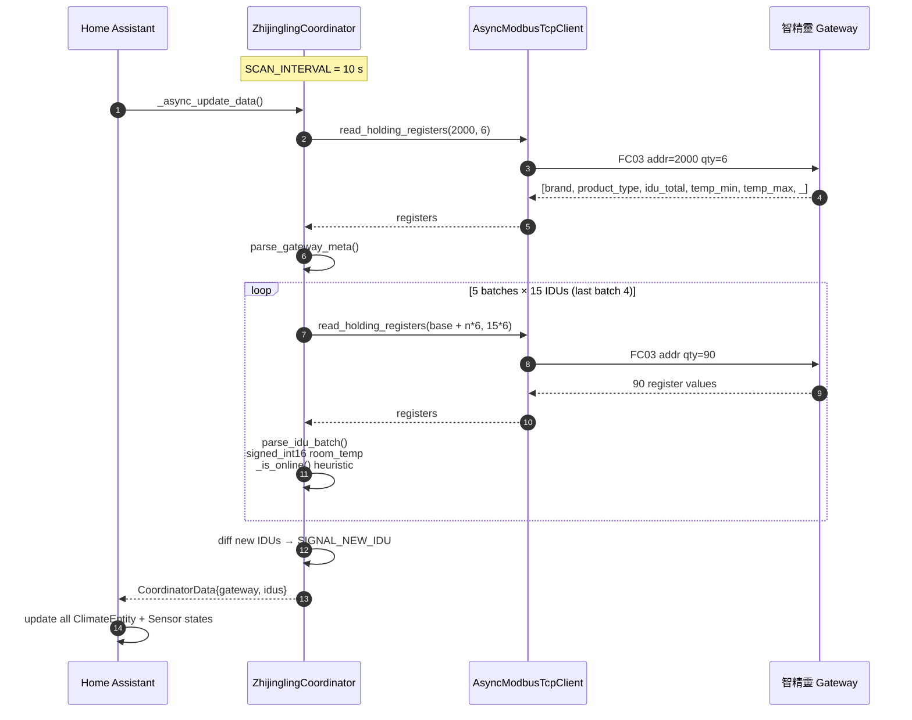
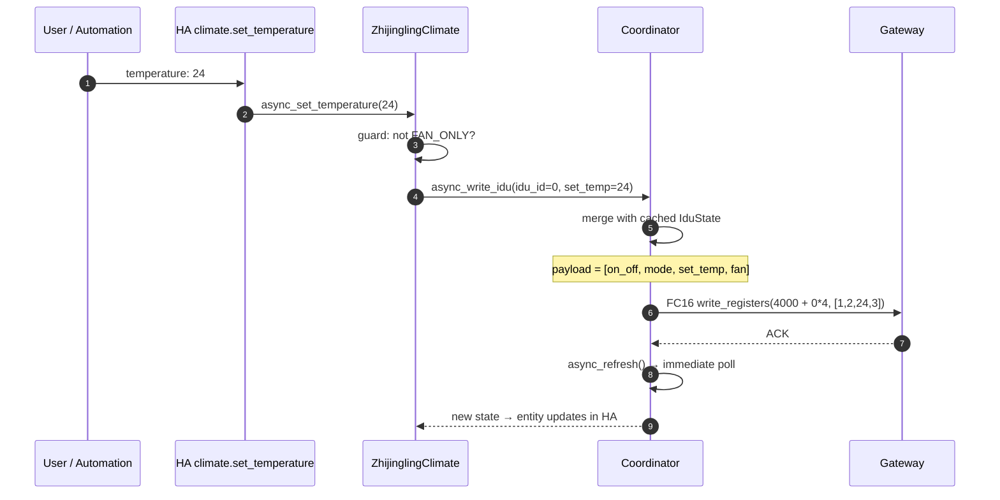
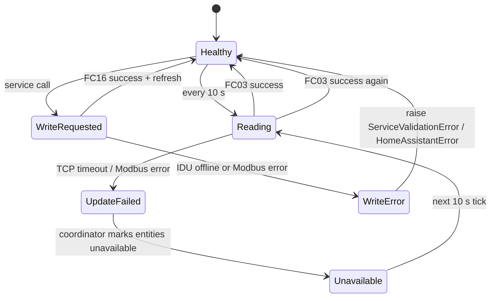
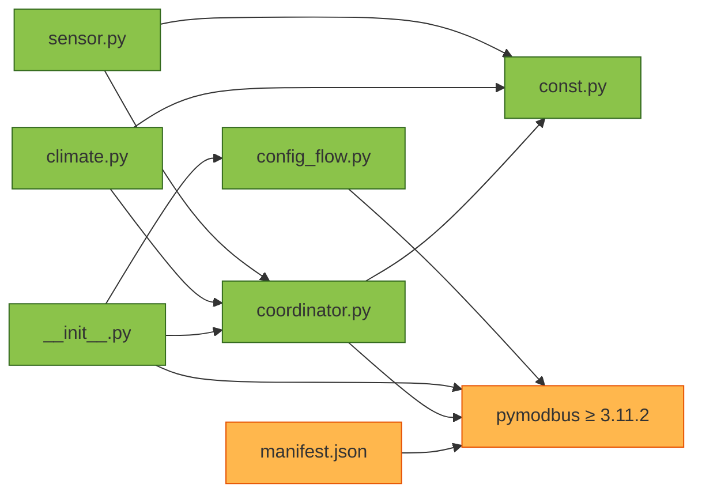

<h1 align="center">ZhiJingLing VRV — Home Assistant Integration</h1>

<p align="center">
  <strong>Native Home Assistant control for ZhiJingLing (智精靈) VRV air-conditioning systems</strong><br/>
  Up to 64 indoor units over a single Modbus TCP gateway. Local-poll. No cloud. HACS-ready.
</p>

<p align="center">
  <a href="#overview">Overview</a> &bull;
  <a href="#features">Features</a> &bull;
  <a href="#architecture">Architecture</a> &bull;
  <a href="#modbus-protocol">Protocol</a> &bull;
  <a href="#installation">Installation</a> &bull;
  <a href="#configuration">Configuration</a> &bull;
  <a href="#verified-behaviour">Verified Behaviour</a> &bull;
  <a href="#troubleshooting">Troubleshooting</a> &bull;
  <a href="README_zh-TW.md">繁體中文</a>
</p>

<p align="center">
  
  
  
  
  
  
  
</p>

---

## Overview

**ZhiJingLing VRV** is a first-party Home Assistant custom integration for the 智精靈 Modbus-TCP VRV gateway — the small industrial-grade converter that sits between a Daikin/Mitsubishi/Panasonic VRV bus and your LAN. It exposes every indoor unit (IDU) behind the gateway as a native `climate.*` entity, so the whole VRV system becomes controllable and automatable inside Home Assistant with no cloud, no vendor app, no polling scripts.

Under the hood: a single `DataUpdateCoordinator` performs batched `FC03` reads across all 64 IDU slots every 10 seconds, translates the vendor register encoding into HA-native `HVACMode` / `fan_mode` / `temperature`, and dispatches new IDUs onto the platform as they come online. Writes go through `FC16` (write-multiple-registers) so `set_hvac_mode` / `set_temperature` / `set_fan_mode` / `turn_off` all round-trip cleanly.

### Why this integration?

| Pain point without this integration | What ZhiJingLing VRV gives you |
|-------------------------------------|-------------------------------|
| Vendor app is Chinese-only, phone-only, cloud-only | Native HA `climate` entities — voice, dashboards, automations, HomeKit / Google / Alexa via HA |
| Building has 64 IDUs and no per-room automation | Every IDU = one entity, ready for schedules, presence, temperature sensors |
| Modbus TCP is raw registers, not HA-friendly | Register semantics abstracted (mode, fan, setpoint, room temp, fault) |
| Gateway or LAN drops → HA gets stuck on stale values | Coordinator flips entities to `unavailable`; auto-recovers on next successful poll |
| Adding an IDU later means reconfiguring HA | Newly-online IDUs are added dynamically via dispatcher signal — no restart |
| Modbus setpoint range varies per install | Reads gateway-programmed `temp_min` / `temp_max` at handshake, falls back to 16 – 30 °C |
| Vendor SDK is proprietary | 100 % open, `pymodbus>=3.11.2`, TDD-covered, config-flow driven |

### Live evidence

Task 10 smoke test against a live 64-IDU gateway, 2026-07-29:

- 64 climate entities (`climate.nei_ji_1` … `climate.nei_ji_64`)
- 2 diagnostic sensors (`sensor.zhi_jing_ling_vrv_zha_dao_idu_total` = 64, `..._idus_online` = 64)
- Write path: `set_hvac_mode` → `set_temperature` → `set_fan_mode` → `turn_off` all round-tripped
- Kill-restore: blackhole-routed the gateway for 45 s → HA marked entities `unavailable`; on restoration entities came back with prior state preserved, no HA restart needed

Full log: [`docs/smoke-test-2026-07-29.md`](docs/smoke-test-2026-07-29.md).

---

## Features

### Core capabilities

- **64 IDUs on one gateway** — one Modbus TCP link fans out into 64 native climate entities
- **Local polling** — no cloud, no vendor account, 10 s scan interval, `iot_class: local_polling`
- **Config flow only** — no YAML; add via **Settings → Devices & Services → Add integration**
- **Dynamic IDU discovery** — new IDUs powered up post-setup appear automatically (dispatcher signal, no restart)
- **Automatic recovery** — gateway drop → entities `unavailable`; gateway back → next poll reconciles state
- **TDD-covered** — coordinator parsing and const tables ship with pytest suites (see [`tests/`](tests/))

### Per-IDU climate entity

Each `climate.nei_ji_N` exposes:

| Attribute | Values | Notes |
|-----------|--------|-------|
| `hvac_modes` | `off` / `heat` / `cool` / `fan_only` / `dry` | mapped from vendor `mode` register |
| `fan_modes` | `auto` / `low` / `medium` / `high` | mapped from vendor `fan_speed` register |
| `current_temperature` | `int16` °C from IDU sensor | signed — negative values pass through |
| `target_temperature` | °C, step 1 | bounded by gateway-reported `temp_min`/`temp_max` (fallback 16 – 30) |
| `extra_state_attributes.fault_code` | 0 = healthy, non-zero = vendor fault code | pass-through for automations |
| `available` | `false` when IDU offline (room=0, on/off=0, fault=0 all zero) | heuristic per §3 of protocol |

Behavioural guards:

- Cannot change setpoint in `fan_only` mode → raises `ServiceValidationError`
- Cannot change fan speed in `dry` mode → raises `ServiceValidationError`
- Writing to an offline IDU raises `HomeAssistantError("IDU N offline; cannot write")`

### Diagnostic sensors

| Entity | Meaning |
|--------|---------|
| `sensor.zhi_jing_ling_vrv_zha_dao_idu_total` | Gateway-reported total IDUs on the bus |
| `sensor.zhi_jing_ling_vrv_zha_dao_idus_online` | Currently online IDUs (0 – 64) — dashboard-friendly liveness signal |

### Supported gateway inputs (config-flow)

| Field | Default | Range |
|-------|---------|-------|
| Host | (required) | any resolvable IP / hostname |
| Port | `502` | 1 – 65535 |
| Slave ID | `1` | 1 – 247 |

Validation at handshake: gateway must reply to `read_holding_registers(2000, 6)` and report `1 ≤ idu_total ≤ 64`, otherwise the config flow rejects with `invalid_device`.

---

## Architecture

### Component topology



### Data flow (poll cycle)



### Write path



### Failure / recovery



### Module dependency



---

## Modbus Protocol

Full reference: [`docs/protocol.md`](docs/protocol.md).

### Gateway metadata — `FC03 @ 2000` (length 6)

| Offset | Field | Type | Meaning |
|:------:|-------|------|---------|
| 0 | `brand` | uint16 | Vendor brand code |
| 1 | `product_type` | uint16 | VRV family code |
| 2 | `idu_total` | uint16 | Number of IDUs on bus (must be 1 – 64) |
| 3 | `temp_min` | uint16 °C | Installer-programmed minimum setpoint (0 = unset) |
| 4 | `temp_max` | uint16 °C | Installer-programmed maximum setpoint (0 = unset) |
| 5 | `_reserved` | uint16 | Reserved |

### Per-IDU read — `FC03 @ 0 + 6·N` (stride 6)

| Offset | Field | Type | Encoding |
|:------:|-------|------|----------|
| 0 | `on_off` | uint16 | `0`=off, `1`=on |
| 1 | `mode` | uint16 | `1`=heat, `2`=cool, `4`=fan_only, `8`=dry |
| 2 | `set_temp` | uint16 °C | Target temperature |
| 3 | `fan_speed` | uint16 | `0`=auto, `1`=low, `2`=medium, `3`=high |
| 4 | `room_temp` | int16 °C | Signed — negative interpreted via two's complement |
| 5 | `fault_code` | uint16 | `0` = healthy |

Batched: **15 IDUs × 6 regs = 90 registers per FC03** — 64 IDUs are covered in 5 batches (`0`, `90`, `180`, `270`, `360`), keeping under the standard 125-register FC03 ceiling.

### Per-IDU write — `FC16 @ 4000 + 4·N` (stride 4)

| Offset | Field |
|:------:|-------|
| 0 | `on_off` |
| 1 | `mode` |
| 2 | `set_temp` |
| 3 | `fan_speed` |

Writes are always the **full 4-register payload**. The coordinator reads the cached `IduState`, patches the changed field, and writes back all four. If no cache exists (never-seen IDU), it does a fallback FC03 first.

### Online heuristic

```python
def _is_online(on_off, room_temp, fault_code) -> bool:
    return room_temp != 0 or on_off != 0 or fault_code != 0
```

If all three are zero, the IDU slot is treated as **not populated** — filtered out of `idus`, no entity created, `sensor.idus_online` decremented.

---

## Installation

Full step-by-step: [`docs/installation.md`](docs/installation.md).

### Option A — HACS (recommended)

1. HACS → **Integrations** → ⋮ → **Custom repositories**
2. Add `https://github.com/WOOWTECH/Woow_ha_vrv_climate_component`, category **Integration**
3. Search **ZhiJingLing VRV** → **Download**
4. **Settings → System → Restart**
5. **Settings → Devices & Services → Add integration → ZhiJingLing VRV**

### Option B — Manual

```bash
cd /config
git clone https://github.com/WOOWTECH/Woow_ha_vrv_climate_component /tmp/zjl
cp -r /tmp/zjl/custom_components/zhijingling_vrv custom_components/
# Restart Home Assistant
```

Or via the Samba / File-Editor add-on: copy the `custom_components/zhijingling_vrv/` folder into `/config/custom_components/`, then restart HA.

### Requirements

- Home Assistant **2024.10.0** or newer
- Python 3.12+ (matches HA Core runtime)
- `pymodbus>=3.11.2` — declared in `manifest.json`, installed automatically by HA on first setup
- Network route from the HA host to the gateway on TCP `502`

---

## Configuration

**Settings → Devices & Services → Add integration → ZhiJingLing VRV**

| Field | Example | Notes |
|-------|---------|-------|
| Host | `192.168.2.20` | gateway LAN IP |
| Port | `502` | Modbus TCP default |
| Slave ID | `1` | 1 – 247, per gateway rotary switch / firmware |

At submit, the config flow calls `read_holding_registers(2000, 6)` against the gateway. Errors surface as:

- `cannot_connect` — TCP connect failed (wrong IP, blocked port, gateway offline)
- `invalid_device` — connect OK but the reply doesn't look like a ZhiJingLing gateway (bad `idu_total`)
- `unknown` — unexpected exception; check `home-assistant.log`

Successful setup:

- Entry title = `智精靈閘道 (<host>)`
- 64 IDU device entries appear under **Devices**, each with one `climate` entity
- 2 diagnostic sensors attached to the gateway "hub" device

### Gateway prep

The gateway's Modbus TCP mode must be enabled first via its built-in web UI:

> **菜单 → 网络 → 网络协议 → `MODBUS-TCP`** — save, reboot the gateway.

Then confirm the slave-ID rotary matches `1` (default) and IDUs are addressed sequentially from IDU 1.

---

## Verified Behaviour

Live smoke test against a real 64-IDU deployment. Full log: [`docs/smoke-test-2026-07-29.md`](docs/smoke-test-2026-07-29.md).

**Target:** HAOS 2026.4.2 · Asia/Taipei · gateway 192.168.2.20:502 slave 1 · component 0.1.0

### 1. Config flow via REST

```
POST /api/config/config_entries/flow  {"handler":"zhijingling_vrv"}
→ flow_id 01KYQ4GCMFKD5DQK2D2KXQHSEX  step "user"

POST /api/config/config_entries/flow/01KYQ4GCMFKD5DQK2D2KXQHSEX
  {"host":"192.168.2.20","port":502,"slave_id":1}
→ type=create_entry  state=loaded
  title "智精靈閘道 (192.168.2.20)"
```

### 2. Entity discovery

- **64** `climate.nei_ji_1` … `climate.nei_ji_64`  (friendly names 內機 1 … 內機 64)
- **2 sensors:** `sensor.zhi_jing_ling_vrv_zha_dao_idu_total` = 64 · `sensor.zhi_jing_ling_vrv_zha_dao_idus_online` = 64
- Initial states: IDU 1 = `off`; IDU 2 – 64 = `cool`

### 3. Write path — `climate.nei_ji_1`

| Step | Service call | Post-write state |
|------|--------------|------------------|
| 1 | `climate.set_hvac_mode` `hvac_mode: cool` | `state=cool` `temperature=25.0` `fan_mode=high` |
| 2 | `climate.set_temperature` `temperature: 24` | `state=cool` `temperature=24.0` `fan_mode=high` |
| 3 | `climate.set_fan_mode` `fan_mode: auto` | `state=cool` `temperature=24.0` `fan_mode=auto` |
| 4 | `climate.turn_off` | `state=off` `temperature=24.0` `fan_mode=auto` |

All writes surfaced by the next coordinator refresh.

### 4. Kill-restore — blackhole route on the host, 45 s window

```
22:32:49  ip route add blackhole 192.168.2.20        # kill
22:33:15  coordinator: "Modbus Error: No response received after 3 retries"
22:33:32  probe:  climate.nei_ji_1 = unavailable
                  sensor idus_online = unavailable
22:33:34  ip route del blackhole 192.168.2.20        # restore
22:34:04  post:    climate.nei_ji_1 = off (setpoint 24, fan auto preserved)
                   sensor idus_online = 64
                   sensor idu_total   = 64
```

**Recovery is fully automatic — no HA restart required.**

---

## Repository Layout

```
Woow_ha_vrv_climate_component/
├── custom_components/
│   └── zhijingling_vrv/
│       ├── __init__.py          # setup_entry, RuntimeData, pymodbus client
│       ├── config_flow.py       # host/port/slave_id + handshake validation
│       ├── const.py             # DOMAIN, register map, mode/fan tables
│       ├── coordinator.py       # DataUpdateCoordinator, batched FC03, FC16 write
│       ├── climate.py           # ZhijinglingClimate (one per IDU)
│       ├── sensor.py            # idu_total + idus_online diagnostic sensors
│       └── manifest.json        # HA integration manifest
├── tests/
│   ├── conftest.py              # opt-in asyncio.sleep patch
│   ├── test_const.py            # protocol constant regression
│   ├── test_coordinator_parse.py
│   └── test_coordinator_poll.py
├── docs/
│   ├── architecture.md          # deep dive: setup, coordinator, entities, lifecycle
│   ├── protocol.md              # Modbus register map + encoding tables
│   ├── installation.md          # HACS + manual + gateway prep
│   ├── smoke-test-2026-07-29.md # live-hardware smoke test log
│   └── plans/                   # implementation plans (design → tasks)
├── hacs.json                    # HACS manifest
├── pyproject.toml               # pytest + ruff config
├── LICENSE                      # MIT
├── README.md                    # this file
└── README_zh-TW.md              # 繁體中文
```

---

## Dependencies

| Package | Version | Purpose | Source |
|---------|---------|---------|--------|
| `pymodbus` | `>= 3.11.2` | Async Modbus TCP client | https://github.com/pymodbus-dev/pymodbus |
| `homeassistant` | `>= 2024.10.0` | Core APIs (`DataUpdateCoordinator`, `ClimateEntity`, config-flow, dispatcher) | https://github.com/home-assistant/core |
| `voluptuous` | (transitive via HA) | Config-flow schema | https://github.com/alecthomas/voluptuous |

`pymodbus` is the only runtime dependency this integration adds. HA installs it automatically on first setup from `manifest.json.requirements`.

Development / test:

| Package | Version | Purpose |
|---------|---------|---------|
| `pytest` | latest | unit tests |
| `pytest-asyncio` | latest | async test runner (`asyncio_mode = auto`) |
| `ruff` | latest | lint, target `py312`, line-length 100 |

---

## Testing

```bash
# From repo root
pip install pytest pytest-asyncio pymodbus voluptuous
pytest -v
```

Coverage:

- `tests/test_const.py` — freezes the register map / mode / fan tables so a rewrite is impossible without noticing
- `tests/test_coordinator_parse.py` — `signed_int16`, `parse_gateway_meta`, `parse_idu_batch`, `_is_online` heuristic
- `tests/test_coordinator_poll.py` — coordinator polling loop with a mock `AsyncModbusTcpClient`

Integration tests against a real gateway are gated by `@pytest.mark.integration`:

```bash
pytest -m integration -v
```

---

## Troubleshooting

| Symptom | Likely cause | Fix |
|---------|--------------|-----|
| Config flow → `cannot_connect` | Wrong IP / port, HA host can't reach gateway | `nc -vz <host> 502` from HA host |
| Config flow → `invalid_device` | Wrong slave ID, or something else on that port | Check gateway rotary switch; try slave 1 |
| All entities `unavailable` after setup | Gateway rebooted / LAN blip | Wait 10 s — coordinator retries automatically |
| One IDU never appears | IDU offline at setup (heuristic filtered it out) | Power the IDU on — will appear at next poll |
| Setpoint change rejected | Mode is `fan_only` | Switch mode first, then set temperature |
| Fan change rejected | Mode is `dry` | Switch mode first, then set fan |
| Write raises `IDU N offline; cannot write` | IDU dropped off after HA cached state | Wait for reconnect; automations should check `available` |
| HA warning: `via_device` references non-existent gateway device | Known 0.1.0 issue — tracked for pre-2025.12 fix | Non-blocking; entity behaviour unaffected |

Full diagnostic guide: [`docs/architecture.md#troubleshooting`](docs/architecture.md).

---

## Roadmap

- [ ] Register gateway "hub" device explicitly (fix `via_device` warning before HA 2025.12)
- [ ] Add `binary_sensor.zhijingling_vrv_online` for gateway liveness (dashboard-friendly)
- [ ] Optional `climate` swing mode support (if register present in future firmware)
- [ ] i18n: English strings alongside the current 繁中 device names
- [ ] Options flow: adjustable scan interval (currently fixed at 10 s)

Contributions and issue reports: <https://github.com/WOOWTECH/Woow_ha_vrv_climate_component/issues>.

---

## License

MIT — see [`LICENSE`](LICENSE).

## Credits

Developed by **[WOOWTECH](https://github.com/WOOWTECH)**. Modbus stack courtesy of [pymodbus](https://github.com/pymodbus-dev/pymodbus). Verified on Home Assistant OS 2026.4.2 against a live 智精靈 VRV gateway.
