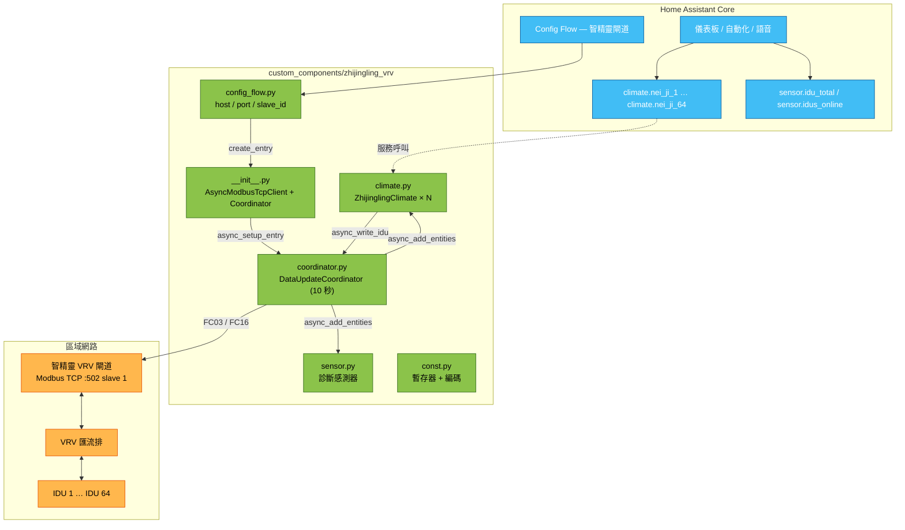
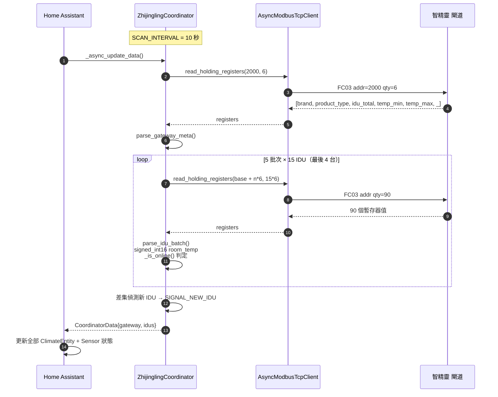
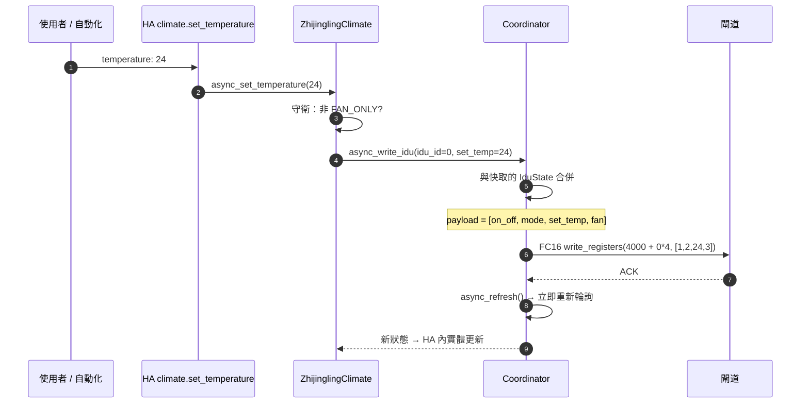
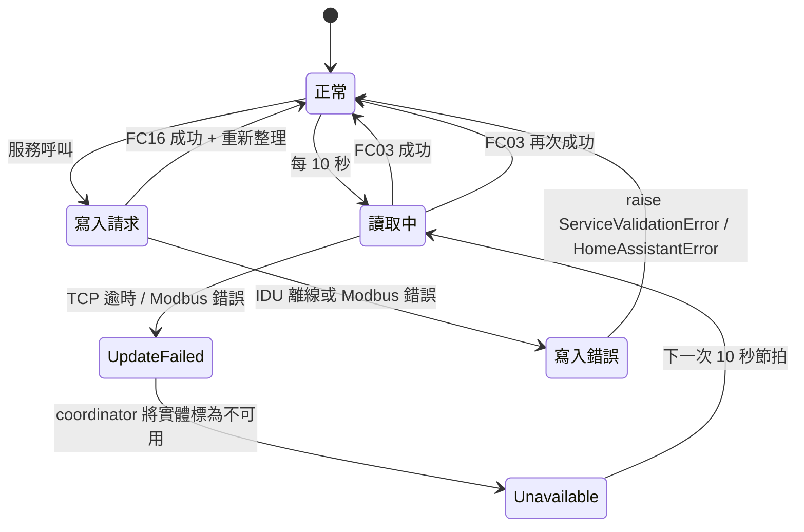
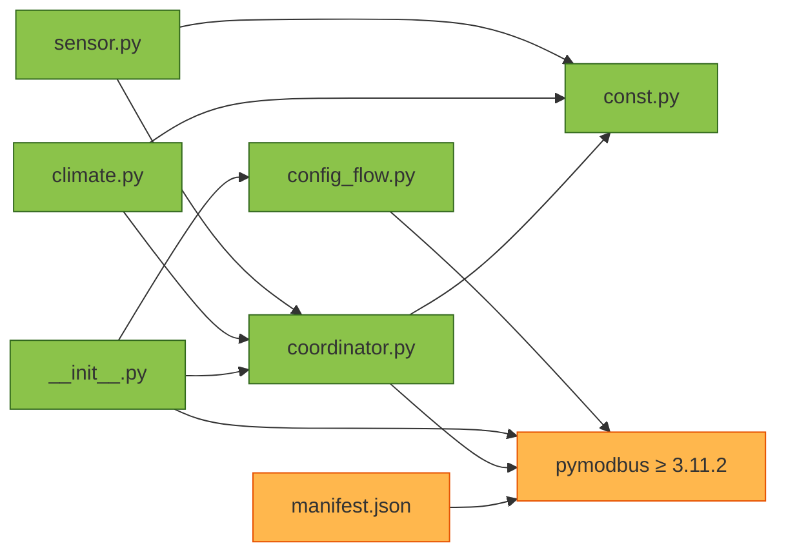

<h1 align="center">智精靈 VRV — Home Assistant 整合套件</h1>

<p align="center">
  <strong>Home Assistant 原生控制智精靈 (ZhiJingLing) VRV 冷氣系統</strong><br/>
  單一 Modbus TCP 閘道支援最多 64 台室內機 (IDU)。本機輪詢，無雲端依賴，HACS 就緒。
</p>

<p align="center">
  <a href="#概述">概述</a> &bull;
  <a href="#功能特色">功能特色</a> &bull;
  <a href="#系統架構">系統架構</a> &bull;
  <a href="#modbus-通訊協定">通訊協定</a> &bull;
  <a href="#安裝說明">安裝說明</a> &bull;
  <a href="#設定指南">設定指南</a> &bull;
  <a href="#實機驗證">實機驗證</a> &bull;
  <a href="#疑難排解">疑難排解</a> &bull;
  <a href="README.md">English</a>
</p>

<p align="center">
  
  
  
  
  
  
  
</p>

---

## 概述

**智精靈 VRV** 是專為 智精靈 Modbus TCP VRV 閘道打造的 Home Assistant 一級整合套件 — 這款工業級小型轉換器安裝在 Daikin/Mitsubishi/Panasonic VRV 匯流排與您的區網之間。它將閘道背後的每一台室內機 (IDU) 顯示為原生 `climate.*` 實體，讓整套 VRV 系統可以在 Home Assistant 內完整控制與自動化 — 完全不需要雲端、不需要廠商 App、不需要手寫輪詢腳本。

實作內部：一個 `DataUpdateCoordinator` 每 10 秒對所有 64 個 IDU 插槽執行批次 `FC03` 讀取，將廠商暫存器編碼轉換為 HA 原生的 `HVACMode` / `fan_mode` / `temperature`，並在新 IDU 上線時透過 dispatcher signal 動態加入平台。寫入透過 `FC16`（write-multiple-registers），因此 `set_hvac_mode` / `set_temperature` / `set_fan_mode` / `turn_off` 全部完整雙向。

### 為什麼選擇此整合？

| 未整合時的痛點 | 智精靈 VRV 帶來的價值 |
|---------------|---------------------|
| 廠商 App 只有中文、只有手機、只有雲端 | 原生 HA `climate` 實體 — 語音、儀表板、自動化、透過 HA 對接 HomeKit / Google / Alexa |
| 大樓 64 台 IDU 無法逐機自動化 | 每台 IDU = 一個實體，可搭配排程、人在感測、溫度感測器 |
| Modbus TCP 是純暫存器，HA 不友善 | 暫存器語義已抽象化（mode、fan、setpoint、room temp、fault） |
| 閘道或 LAN 掉線 → HA 卡在舊值 | Coordinator 將實體切為 `unavailable`；下次成功輪詢自動恢復 |
| 事後新增 IDU 需重新設定 HA | 新上線的 IDU 透過 dispatcher signal 自動加入 — 無需重啟 |
| Modbus 溫度上下限因安裝不同 | 交握時讀取閘道端已設定的 `temp_min` / `temp_max`，未設定時回退到 16 – 30 °C |
| 廠商 SDK 為封閉專案 | 100 % 開源，`pymodbus>=3.11.2`，TDD 覆蓋，config-flow 驅動 |

### 實機驗證

Task 10 針對真實 64 台 IDU 閘道的煙霧測試，2026-07-29：

- 64 個 climate 實體 (`climate.nei_ji_1` … `climate.nei_ji_64`)
- 2 個診斷感測器 (`sensor.zhi_jing_ling_vrv_zha_dao_idu_total` = 64、`..._idus_online` = 64)
- 寫入路徑：`set_hvac_mode` → `set_temperature` → `set_fan_mode` → `turn_off` 全部往返成功
- 中斷復原：以 blackhole 路由封鎖閘道 45 秒 → HA 將實體標為 `unavailable`；復原後實體回到原始狀態，無需重啟 HA

完整記錄：[`docs/smoke-test-2026-07-29.md`](docs/smoke-test-2026-07-29.md)。

---

## 功能特色

### 核心能力

- **單閘道 64 台 IDU** — 一條 Modbus TCP 連線展開為 64 個原生 climate 實體
- **本機輪詢** — 無雲端、無廠商帳號、10 秒掃描週期、`iot_class: local_polling`
- **僅 config flow** — 完全不用 YAML；透過 **設定 → 裝置與服務 → 新增整合** 加入
- **動態 IDU 發現** — 設定完成後才上電的 IDU 會自動出現（dispatcher signal，無需重啟）
- **自動復原** — 閘道掉線 → 實體轉為 `unavailable`；閘道恢復 → 下次輪詢對齊狀態
- **TDD 覆蓋** — coordinator 解析與常數表附帶 pytest 測試（見 [`tests/`](tests/)）

### 每台 IDU 的 climate 實體

每個 `climate.nei_ji_N` 提供：

| 屬性 | 值域 | 說明 |
|------|------|------|
| `hvac_modes` | `off` / `heat` / `cool` / `fan_only` / `dry` | 由廠商 `mode` 暫存器對應 |
| `fan_modes` | `auto` / `low` / `medium` / `high` | 由廠商 `fan_speed` 暫存器對應 |
| `current_temperature` | IDU 感測器 `int16` °C | 有號 — 負值原樣傳遞 |
| `target_temperature` | °C，步進 1 | 邊界由閘道回報的 `temp_min` / `temp_max` 決定（回退 16 – 30） |
| `extra_state_attributes.fault_code` | 0 = 正常，非 0 = 廠商故障碼 | 直接透傳給自動化使用 |
| `available` | IDU 離線時為 `false`（room=0、on/off=0、fault=0 三者皆 0） | 見通訊協定 §3 |

行為守衛：

- `fan_only` 模式時無法修改設定溫度 → 拋出 `ServiceValidationError`
- `dry` 模式時無法修改風速 → 拋出 `ServiceValidationError`
- 對離線 IDU 寫入會拋出 `HomeAssistantError("IDU N offline; cannot write")`

### 診斷感測器

| 實體 | 意義 |
|------|------|
| `sensor.zhi_jing_ling_vrv_zha_dao_idu_total` | 閘道回報的匯流排總 IDU 數 |
| `sensor.zhi_jing_ling_vrv_zha_dao_idus_online` | 目前上線 IDU 數（0 – 64）— 儀表板方便使用的活性訊號 |

### Config Flow 支援的閘道輸入

| 欄位 | 預設 | 範圍 |
|------|------|------|
| Host | (必填) | 任意可解析 IP / 主機名 |
| Port | `502` | 1 – 65535 |
| Slave ID | `1` | 1 – 247 |

交握驗證：閘道必須回應 `read_holding_registers(2000, 6)` 且回報 `1 ≤ idu_total ≤ 64`，否則 config flow 以 `invalid_device` 拒絕。

---

## 系統架構

### 元件拓撲



### 資料流（輪詢週期）



### 寫入路徑



### 失敗 / 復原



### 模組相依



---

## Modbus 通訊協定

完整參考：[`docs/protocol.md`](docs/protocol.md)。

### 閘道 metadata — `FC03 @ 2000`（長度 6）

| 偏移 | 欄位 | 型別 | 意義 |
|:----:|------|------|------|
| 0 | `brand` | uint16 | 廠商品牌碼 |
| 1 | `product_type` | uint16 | VRV 家族碼 |
| 2 | `idu_total` | uint16 | 匯流排 IDU 總數（必須 1 – 64） |
| 3 | `temp_min` | uint16 °C | 安裝人員設定的最小 setpoint（0 = 未設定） |
| 4 | `temp_max` | uint16 °C | 安裝人員設定的最大 setpoint（0 = 未設定） |
| 5 | `_reserved` | uint16 | 保留 |

### 每 IDU 讀取 — `FC03 @ 0 + 6·N`（步進 6）

| 偏移 | 欄位 | 型別 | 編碼 |
|:----:|------|------|------|
| 0 | `on_off` | uint16 | `0`=關、`1`=開 |
| 1 | `mode` | uint16 | `1`=heat、`2`=cool、`4`=fan_only、`8`=dry |
| 2 | `set_temp` | uint16 °C | 目標溫度 |
| 3 | `fan_speed` | uint16 | `0`=auto、`1`=low、`2`=medium、`3`=high |
| 4 | `room_temp` | int16 °C | 有號 — 以二補數解釋負值 |
| 5 | `fault_code` | uint16 | `0` = 正常 |

批次策略：**15 IDU × 6 regs = 90 暫存器一次 FC03** — 64 IDU 分 5 批次 (`0`、`90`、`180`、`270`、`360`)，均低於 FC03 標準 125 暫存器上限。

### 每 IDU 寫入 — `FC16 @ 4000 + 4·N`（步進 4）

| 偏移 | 欄位 |
|:----:|------|
| 0 | `on_off` |
| 1 | `mode` |
| 2 | `set_temp` |
| 3 | `fan_speed` |

寫入永遠是完整 **4 暫存器 payload**。Coordinator 讀取快取的 `IduState`，修補變動欄位，然後回寫四個暫存器。若無快取（從未見過的 IDU），先做一次 fallback FC03。

### 上線判定

```python
def _is_online(on_off, room_temp, fault_code) -> bool:
    return room_temp != 0 or on_off != 0 or fault_code != 0
```

若三者皆為 0，該 IDU 插槽視為 **未安裝** — 從 `idus` 中過濾、不建立實體、`sensor.idus_online` 減 1。

---

## 安裝說明

完整步驟：[`docs/installation.md`](docs/installation.md)。

### 方法 A — HACS（建議）

1. HACS → **Integrations** → ⋮ → **Custom repositories**
2. 加入 `https://github.com/WOOWTECH/Woow_ha_vrv_climate_component`，類別選 **Integration**
3. 搜尋 **ZhiJingLing VRV** → **Download**
4. **設定 → 系統 → 重新啟動**
5. **設定 → 裝置與服務 → 新增整合 → ZhiJingLing VRV**

### 方法 B — 手動

```bash
cd /config
git clone https://github.com/WOOWTECH/Woow_ha_vrv_climate_component /tmp/zjl
cp -r /tmp/zjl/custom_components/zhijingling_vrv custom_components/
# 重新啟動 Home Assistant
```

或透過 Samba / File Editor 附加元件：將 `custom_components/zhijingling_vrv/` 資料夾複製到 `/config/custom_components/`，然後重啟 HA。

### 系統需求

- Home Assistant **2024.10.0** 或更新版本
- Python 3.12+（對應 HA Core runtime）
- `pymodbus>=3.11.2` — 已於 `manifest.json` 宣告，HA 首次設定時會自動安裝
- HA 主機到閘道 TCP `502` 的網路路由

---

## 設定指南

**設定 → 裝置與服務 → 新增整合 → ZhiJingLing VRV**

| 欄位 | 範例 | 說明 |
|------|------|------|
| Host | `192.168.2.20` | 閘道 LAN IP |
| Port | `502` | Modbus TCP 預設埠 |
| Slave ID | `1` | 1 – 247，依閘道旋鈕 / 韌體設定 |

送出時，config flow 會對閘道呼叫 `read_holding_registers(2000, 6)`。錯誤呈現：

- `cannot_connect` — TCP 連線失敗（IP 錯誤、port 被擋、閘道離線）
- `invalid_device` — 連線 OK 但回應不像智精靈閘道（`idu_total` 不合法）
- `unknown` — 意外例外，請檢查 `home-assistant.log`

成功設定後：

- 項目標題 = `智精靈閘道 (<host>)`
- 64 個 IDU 裝置出現在 **裝置** 內，每個都有一個 `climate` 實體
- 2 個診斷 sensor 掛在閘道 "hub" 裝置下

### 閘道端準備

閘道的 Modbus TCP 模式必須先透過內建 Web UI 開啟：

> **菜单 → 网络 → 网络协议 → `MODBUS-TCP`** — 儲存、重新啟動閘道。

然後確認 slave-ID 旋鈕為 `1`（預設），IDU 位址從 IDU 1 起連續。

---

## 實機驗證

真實 64 IDU 環境的煙霧測試。完整記錄：[`docs/smoke-test-2026-07-29.md`](docs/smoke-test-2026-07-29.md)。

**環境：** HAOS 2026.4.2 · Asia/Taipei · 閘道 192.168.2.20:502 slave 1 · 元件 0.1.0

### 1. Config flow via REST

```
POST /api/config/config_entries/flow  {"handler":"zhijingling_vrv"}
→ flow_id 01KYQ4GCMFKD5DQK2D2KXQHSEX  step "user"

POST /api/config/config_entries/flow/01KYQ4GCMFKD5DQK2D2KXQHSEX
  {"host":"192.168.2.20","port":502,"slave_id":1}
→ type=create_entry  state=loaded
  title "智精靈閘道 (192.168.2.20)"
```

### 2. 實體發現

- **64** 個 `climate.nei_ji_1` … `climate.nei_ji_64`（friendly name 內機 1 … 內機 64）
- **2 個 sensor：** `sensor.zhi_jing_ling_vrv_zha_dao_idu_total` = 64 · `sensor.zhi_jing_ling_vrv_zha_dao_idus_online` = 64
- 初始狀態：IDU 1 = `off`；IDU 2 – 64 = `cool`

### 3. 寫入路徑 — `climate.nei_ji_1`

| 步驟 | 服務呼叫 | 寫入後狀態 |
|------|----------|-----------|
| 1 | `climate.set_hvac_mode` `hvac_mode: cool` | `state=cool` `temperature=25.0` `fan_mode=high` |
| 2 | `climate.set_temperature` `temperature: 24` | `state=cool` `temperature=24.0` `fan_mode=high` |
| 3 | `climate.set_fan_mode` `fan_mode: auto` | `state=cool` `temperature=24.0` `fan_mode=auto` |
| 4 | `climate.turn_off` | `state=off` `temperature=24.0` `fan_mode=auto` |

所有寫入於下次 coordinator refresh 時呈現。

### 4. 中斷復原 — 主機 blackhole 路由，45 秒視窗

```
22:32:49  ip route add blackhole 192.168.2.20        # 阻斷
22:33:15  coordinator: "Modbus Error: No response received after 3 retries"
22:33:32  探測：climate.nei_ji_1 = unavailable
                sensor idus_online = unavailable
22:33:34  ip route del blackhole 192.168.2.20        # 恢復
22:34:04  復原後：climate.nei_ji_1 = off（保留 setpoint 24、fan auto）
                  sensor idus_online = 64
                  sensor idu_total   = 64
```

**完全自動復原 — 無需重啟 HA。**

---

## 倉庫檔案結構

```
Woow_ha_vrv_climate_component/
├── custom_components/
│   └── zhijingling_vrv/
│       ├── __init__.py          # setup_entry、RuntimeData、pymodbus 客戶端
│       ├── config_flow.py       # host/port/slave_id + 交握驗證
│       ├── const.py             # DOMAIN、暫存器對應、模式/風速表
│       ├── coordinator.py       # DataUpdateCoordinator、批次 FC03、FC16 寫入
│       ├── climate.py           # ZhijinglingClimate（每 IDU 一個）
│       ├── sensor.py            # idu_total + idus_online 診斷感測器
│       └── manifest.json        # HA 整合 manifest
├── tests/
│   ├── conftest.py              # opt-in asyncio.sleep patch
│   ├── test_const.py            # 通訊協定常數回歸測試
│   ├── test_coordinator_parse.py
│   └── test_coordinator_poll.py
├── docs/
│   ├── architecture.md          # 深入解析：setup、coordinator、entities、生命週期
│   ├── protocol.md              # Modbus 暫存器對應 + 編碼表
│   ├── installation.md          # HACS + 手動 + 閘道準備
│   ├── smoke-test-2026-07-29.md # 實機煙霧測試記錄
│   └── plans/                   # 實作計畫（設計 → 任務）
├── hacs.json                    # HACS manifest
├── pyproject.toml               # pytest + ruff 設定
├── LICENSE                      # MIT
├── README.md                    # English
└── README_zh-TW.md              # 本檔
```

---

## 相依套件

| 套件 | 版本 | 用途 | 來源 |
|------|------|------|------|
| `pymodbus` | `>= 3.11.2` | 非同步 Modbus TCP 客戶端 | https://github.com/pymodbus-dev/pymodbus |
| `homeassistant` | `>= 2024.10.0` | 核心 API（`DataUpdateCoordinator`、`ClimateEntity`、config-flow、dispatcher） | https://github.com/home-assistant/core |
| `voluptuous` | (透過 HA 傳遞) | Config flow schema | https://github.com/alecthomas/voluptuous |

本整合唯一新增的執行期相依為 `pymodbus`，HA 首次設定時會自動從 `manifest.json.requirements` 安裝。

開發 / 測試相依：

| 套件 | 版本 | 用途 |
|------|------|------|
| `pytest` | latest | 單元測試 |
| `pytest-asyncio` | latest | 非同步測試執行器（`asyncio_mode = auto`） |
| `ruff` | latest | Lint，目標 `py312`，line-length 100 |

---

## 測試

```bash
# 從倉庫根目錄
pip install pytest pytest-asyncio pymodbus voluptuous
pytest -v
```

覆蓋範圍：

- `tests/test_const.py` — 凍結暫存器對應 / 模式 / 風速表，任何重寫都會被立即發現
- `tests/test_coordinator_parse.py` — `signed_int16`、`parse_gateway_meta`、`parse_idu_batch`、`_is_online` 判定
- `tests/test_coordinator_poll.py` — 使用 mock `AsyncModbusTcpClient` 測試 coordinator 輪詢迴圈

需要真實閘道的整合測試以 `@pytest.mark.integration` 標記：

```bash
pytest -m integration -v
```

---

## 疑難排解

| 症狀 | 可能原因 | 解決方式 |
|------|---------|---------|
| Config flow → `cannot_connect` | IP / port 錯誤，HA 主機無法連到閘道 | 從 HA 主機執行 `nc -vz <host> 502` |
| Config flow → `invalid_device` | Slave ID 錯誤，或該 port 上跑其他協定 | 檢查閘道旋鈕；先試 slave 1 |
| 設定後所有實體 `unavailable` | 閘道重開機或 LAN 短暫中斷 | 等 10 秒 — coordinator 會自動重試 |
| 某台 IDU 一直沒出現 | 設定當下該 IDU 離線（被判定過濾） | 供電 IDU，下次輪詢即會加入 |
| 修改 setpoint 被拒 | 目前為 `fan_only` 模式 | 先切換模式再改溫度 |
| 修改風速被拒 | 目前為 `dry` 模式 | 先切換模式再改風速 |
| 寫入拋出 `IDU N offline; cannot write` | HA 快取到狀態後 IDU 才掉線 | 等待重新連線；自動化建議先檢查 `available` |
| HA 警告：`via_device` 參照不存在的閘道裝置 | 已知 0.1.0 議題 — 追蹤於 HA 2025.12 前修復 | 不影響實體行為 |

完整診斷指南：[`docs/architecture.md#troubleshooting`](docs/architecture.md)。

---

## Roadmap

- [ ] 顯式註冊閘道 "hub" 裝置（在 HA 2025.12 前修復 `via_device` 警告）
- [ ] 新增 `binary_sensor.zhijingling_vrv_online` 作為閘道活性訊號（儀表板友好）
- [ ] 若未來韌體新增擺葉暫存器則支援 climate swing mode
- [ ] i18n：在目前繁中裝置名之外新增英文字串
- [ ] Options flow：可調掃描週期（目前固定 10 秒）

貢獻與問題回報：<https://github.com/WOOWTECH/Woow_ha_vrv_climate_component/issues>。

---

## License

MIT — 見 [`LICENSE`](LICENSE)。

## 致謝

由 **[WOOWTECH](https://github.com/WOOWTECH)** 開發。Modbus 堆疊使用 [pymodbus](https://github.com/pymodbus-dev/pymodbus)。已於 Home Assistant OS 2026.4.2 對接真實智精靈 VRV 閘道實機驗證。
