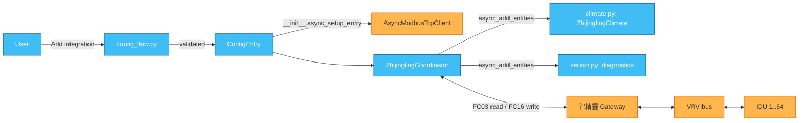
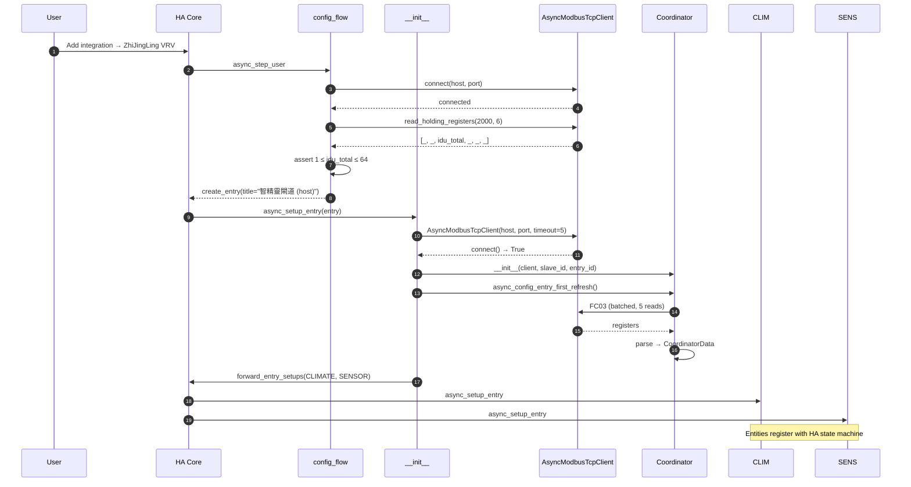
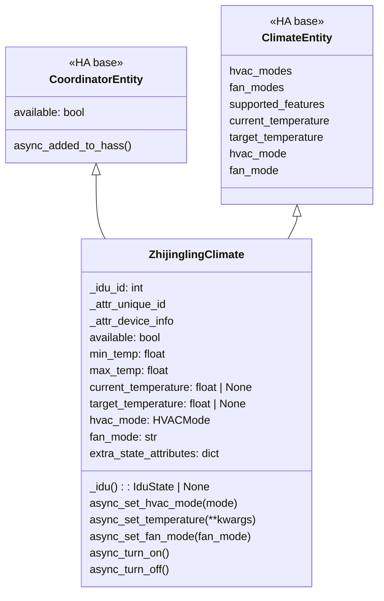
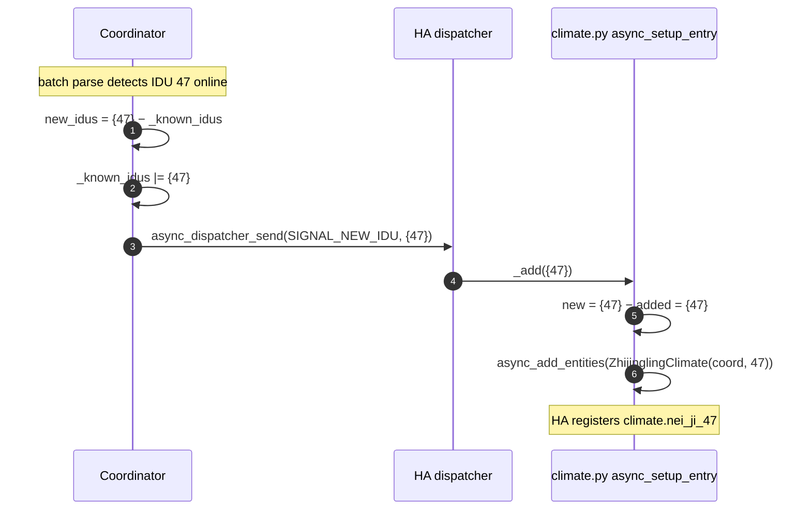
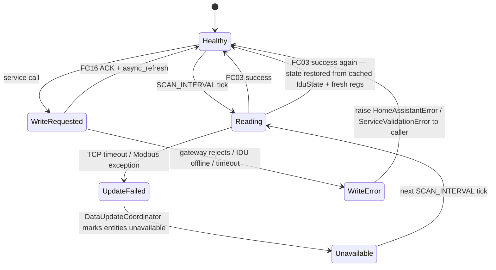

# Architecture

Deep-dive on the internal design of the `zhijingling_vrv` custom integration. Covers setup lifecycle, coordinator polling, entity model, and failure modes. For the register-level view see [`protocol.md`](protocol.md); for wiring HA to a live gateway see [`installation.md`](installation.md).

## 1. High-level view



## 2. Setup lifecycle



Key API touch points:

- `config_flow.ZhijinglingConfigFlow` — validates handshake, sets a unique ID of `host:port`, prevents duplicate config entries
- `__init__.async_setup_entry` — creates the `AsyncModbusTcpClient`, boots the coordinator, and forwards to the `climate` + `sensor` platforms
- `__init__.async_unload_entry` — cleans up the client on integration removal / reload

## 3. Coordinator: polling model

```mermaid
flowchart TB
    START[Every SCAN_INTERVAL = 10 s]
    -->|_async_update_data| META[Read gateway meta: FC03 @ 2000, qty 6]
    --> PARSE_META[parse_gateway_meta → GatewayData]
    --> LOOP[For batch_start in 0..64 step 15]
    LOOP --> READ[FC03 @ batch_start*6, qty count*6]
    READ --> PARSE[parse_idu_batch → dict[int, IduState|None]]
    PARSE -->|_is_online| FILTER[Keep only online IDUs]
    FILTER --> NEXT{More batches?}
    NEXT -->|yes| LOOP
    NEXT -->|no| DIFF[current_online − _known_idus = new_idus]
    DIFF -->|new_idus non-empty| DISPATCH[async_dispatcher_send SIGNAL_NEW_IDU]
    DIFF --> RET[return CoordinatorData]
```

### Register access constants (from `const.py`)

| Constant | Value | Meaning |
|----------|-------|---------|
| `SCAN_INTERVAL` | `timedelta(seconds=10)` | Coordinator poll cadence |
| `MAX_IDUS` | 64 | Hard cap enforced by config flow validation |
| `BATCH_SIZE` | 15 | IDUs per FC03 read; 15 × 6 = 90 regs, safely under 125-reg FC03 limit |
| `REG_GATEWAY_META` | 2000 | Base of gateway metadata |
| `REG_IDU_READ_BASE` | 0 | Base of per-IDU read block |
| `REG_IDU_WRITE_BASE` | 4000 | Base of per-IDU write block |

### Write path (`async_write_idu`)

```mermaid
flowchart TB
    IN[async_write_idu idu_id, on_off?, mode?, set_temp?, fan_speed?]
    IN --> CACHE{cached self.data.idus[idu_id]?}
    CACHE -->|hit| MERGE
    CACHE -->|miss| FB[FC03 @ REG_IDU_READ_BASE + idu_id*6, qty 6]
    FB --> PIB[parse_idu_batch count=1]
    PIB --> ONL{IduState is None?}
    ONL -->|yes| RAISE[raise HomeAssistantError IDU offline]
    ONL -->|no| MERGE[merge args with cached IduState]
    MERGE --> WRITE[FC16 @ REG_IDU_WRITE_BASE + idu_id*4, payload=4 regs]
    WRITE -->|OK| REF[async_refresh → immediate poll]
    WRITE -->|error| RAISE2[raise HomeAssistantError Modbus write failed]
```

Writes are idempotent from the caller's point of view: even a single-field update (e.g. only `set_temp=24`) is serialized as the full `[on_off, mode, set_temp, fan_speed]` payload, so the coordinator's local cache never desyncs from the gateway.

## 4. Entity model



### Guarded transitions

Two vendor-imposed rules are enforced client-side to avoid gateway rejections:

- `async_set_temperature` raises `ServiceValidationError` if `hvac_mode == FAN_ONLY`
- `async_set_fan_mode` raises `ServiceValidationError` if `hvac_mode == DRY`

Users who need to override these must first switch mode.

### Device registry

Each `ZhijinglingClimate` declares a `DeviceInfo` with:

- `identifiers = {(DOMAIN, f"{entry_id}_idu_{idu_id}")}` — one device per IDU
- `via_device = (DOMAIN, f"{entry_id}_gateway")` — points at the (currently implicit) gateway hub device
- `name = 內機 N` (0-indexed slot + 1) — matches vendor-issued labels
- `manufacturer = 智精靈`, `model = VRV IDU (slot N)`

## 5. Dynamic IDU addition



Signal name: `zhijingling_vrv_new_idu_{entry_id}` — namespaced by entry so multiple gateway entries don't cross-talk. Subscribers are cleaned up automatically by `entry.async_on_unload`.

## 6. Failure model



The coordinator wraps every read in `UpdateFailed(...)` — HA's standard mechanism for signalling entity unavailability. During the outage:

- All child entities report `available = False`
- Automations that depend on `not is_state('climate.nei_ji_1', 'unavailable')` short-circuit correctly
- No stale values are exposed to Lovelace

On recovery, the very next successful poll fully rehydrates state — no explicit reconnect logic needed.

## 7. Troubleshooting

### Enable debug logs

Add to `configuration.yaml`:

```yaml
logger:
  default: warning
  logs:
    custom_components.zhijingling_vrv: debug
    pymodbus: warning
```

### Common issues

| Log line | Meaning | Action |
|----------|---------|--------|
| `Modbus read 2000+6 failed: ModbusIOException(...)` | Handshake failed | Check TCP connectivity, gateway Modbus mode |
| `Modbus read N+90 failed: ...` | Mid-batch read failed | Coordinator will retry on next tick; look for LAN issues |
| `Update failed for zhijingling_vrv_<entry>` | Entire poll cycle aborted | Entities go unavailable; investigate network + gateway logs |
| `IDU N offline; cannot write` | Write attempted on filtered-out IDU | Confirm IDU is powered and appears in next poll |
| `Detected that custom integration 'zhijingling_vrv' calls device_registry.async_get_or_create referencing a non existing via_device` | Known 0.1.0 issue — gateway hub device not registered explicitly | Non-blocking; scheduled fix before HA 2025.12 |

### Verify from HA host

```bash
# TCP reachability
nc -vz 192.168.2.20 502

# Modbus handshake (with mbpoll or similar)
mbpoll -a 1 -t 3 -r 2001 -c 6 192.168.2.20
# Register 2001 = idu_total (1-based); expect 1..64
```

### Reset state

- **Reload integration:** Settings → Devices & Services → ZhiJingLing VRV → ⋮ → Reload
- **Remove entities:** Settings → Devices & Services → Entities → filter by integration → select → Delete
- **Remove integration:** Settings → Devices & Services → ⋮ → Delete — removes entities, devices, and disconnects the Modbus client

---

Cross-refs: [`protocol.md`](protocol.md) · [`installation.md`](installation.md) · [`smoke-test-2026-07-29.md`](smoke-test-2026-07-29.md)
