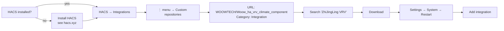
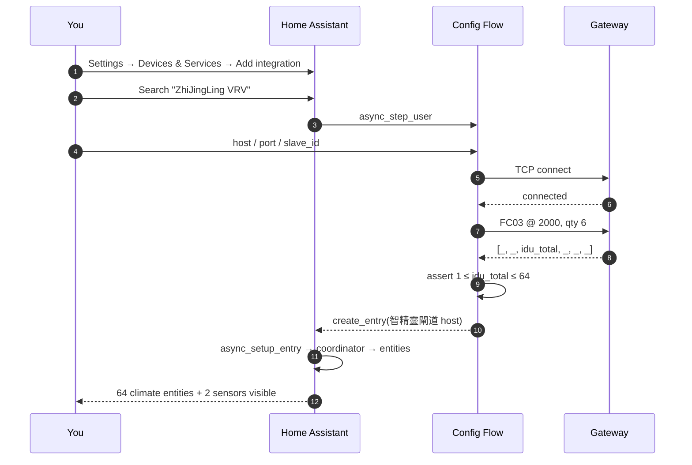

# Installation Guide

End-to-end setup for a fresh Home Assistant install talking to a 智精靈 VRV Modbus TCP gateway. Follow either the HACS route (recommended) or the manual route, then finish with the shared **Gateway prep** and **Configuration** steps.

## 0. Prerequisites

- Home Assistant **2024.10.0** or newer (Container / Core / OS / Supervised — all work)
- Python **3.12+** (matches HA Core runtime — no action needed if you use HAOS or the container image)
- Network route from the HA host to the gateway on TCP **502**
- Gateway physically wired to the VRV bus and powered on
- Gateway's Modbus TCP mode enabled (see §3 below)

## 1. Route A — HACS (recommended)



**Steps:**

1. In Home Assistant, open **HACS → Integrations**
2. Click ⋮ (top-right) → **Custom repositories**
3. **Repository:** `https://github.com/WOOWTECH/Woow_ha_vrv_climate_component`
4. **Category:** `Integration`
5. Click **Add**
6. Search for **ZhiJingLing VRV** in the HACS integrations list → **Download**
7. **Settings → System → Restart**

## 2. Route B — Manual

Suitable for HAOS without HACS, air-gapped installs, or developers pinning a commit.

```bash
# On the HA host (or via Samba / File-Editor add-on)
cd /config
mkdir -p custom_components
git clone https://github.com/WOOWTECH/Woow_ha_vrv_climate_component /tmp/zjl
cp -r /tmp/zjl/custom_components/zhijingling_vrv custom_components/

# Verify layout
ls custom_components/zhijingling_vrv
# Expected: __init__.py  climate.py  config_flow.py  const.py
#           coordinator.py  manifest.json  sensor.py  strings.json  translations/

# Restart HA (Settings → System → Restart, or via CLI)
```

### Via File Editor add-on (HAOS)

1. Install / open **File editor** or **Samba share** add-on
2. Under `/config/`, create `custom_components/zhijingling_vrv/` if missing
3. Upload all files from the repo's `custom_components/zhijingling_vrv/` directory
4. **Settings → System → Restart**

### Via HAOS SSH add-on

```bash
# Inside the SSH add-on shell
cd /config
git clone https://github.com/WOOWTECH/Woow_ha_vrv_climate_component /tmp/zjl
cp -r /tmp/zjl/custom_components/zhijingling_vrv custom_components/
ha core restart
```

`pymodbus>=3.11.2` is declared in `manifest.json.requirements` — HA installs it automatically on first setup.

## 3. Gateway prep

### 3.1 Enable Modbus TCP mode

The gateway ships in a proprietary vendor-mode. Modbus TCP must be enabled via the built-in Web UI:

1. Open the gateway's LAN IP in a browser (default 192.168.1.x with DHCP; check your router)
2. Log in (default vendor credentials — check the shipping label)
3. Navigate: **菜单 → 网络 → 网络协议**
4. Select **`MODBUS-TCP`**
5. **保存 (save)**
6. **重新启动 (reboot)** the gateway

### 3.2 Verify slave ID

The gateway has a physical rotary switch (or software field) for the Modbus slave / device ID. Default is `1` and this integration defaults to `1`. Only change it if you have multiple gateways sharing a Modbus master — in which case use the corresponding value in the HA config flow.

### 3.3 Verify network reachability

From the HA host (or SSH add-on):

```bash
# TCP reachability
nc -vz <gateway-ip> 502
# Connection to <gateway-ip> port 502 [tcp/*] succeeded!

# Modbus handshake if mbpoll is available
mbpoll -a 1 -t 3 -r 2001 -c 6 <gateway-ip>
# -- Polling slave...
# [2001]:     1     3    64    16    30     0
#                          ^^ idu_total (here: 64)
```

If `nc` fails, check firewall / VLAN / gateway power. If `mbpoll` reports illegal function or invalid device, check the slave ID and that Modbus TCP mode is actually enabled.

## 4. Add the integration in HA



**Steps:**

1. **Settings → Devices & Services → Add integration**
2. Search **ZhiJingLing VRV**
3. Fill in:

| Field | Value | Notes |
|-------|-------|-------|
| Host | e.g. `192.168.2.20` | Gateway LAN IP |
| Port | `502` | Modbus TCP default |
| Slave ID | `1` | Match your gateway rotary switch |

4. **Submit**. Success flash: *"智精靈閘道 (192.168.2.20)"*.

## 5. Verify

Immediately after setup, expect:

| Entity | Expected |
|--------|----------|
| Device tree under **智精靈 VRV** | 64 IDU devices |
| `climate.nei_ji_1` … `climate.nei_ji_64` | `state` = current mode or `off` |
| `sensor.zhi_jing_ling_vrv_zha_dao_idu_total` | equals installed IDU count |
| `sensor.zhi_jing_ling_vrv_zha_dao_idus_online` | equals currently powered IDUs |

Fire a test service call from **Developer Tools → Services**:

```yaml
service: climate.set_temperature
target:
  entity_id: climate.nei_ji_1
data:
  temperature: 24
```

Within 10 seconds (next poll) the entity's `attributes.temperature` should reflect `24.0`.

## 6. Uninstall

**Settings → Devices & Services → ZhiJingLing VRV → ⋮ → Delete**

This unloads the coordinator, closes the TCP connection, removes all 64 IDU devices and their entities. To also remove the code:

- HACS route: **HACS → Integrations → ZhiJingLing VRV → ⋮ → Remove**
- Manual route: `rm -rf /config/custom_components/zhijingling_vrv/`

Restart HA to complete cleanup.

## 7. Upgrade

- **HACS:** HACS → Integrations → ZhiJingLing VRV → **Update** → **Restart HA**
- **Manual:** `git pull` in the vendored clone → copy the fresh `custom_components/zhijingling_vrv` over the old one → restart HA

`manifest.json.version` is bumped per release; the HA config entry survives upgrades and does not need to be re-created.

---

Cross-refs: [`README.md`](../README.md) · [`architecture.md`](architecture.md) · [`protocol.md`](protocol.md) · [`smoke-test-2026-07-29.md`](smoke-test-2026-07-29.md)
