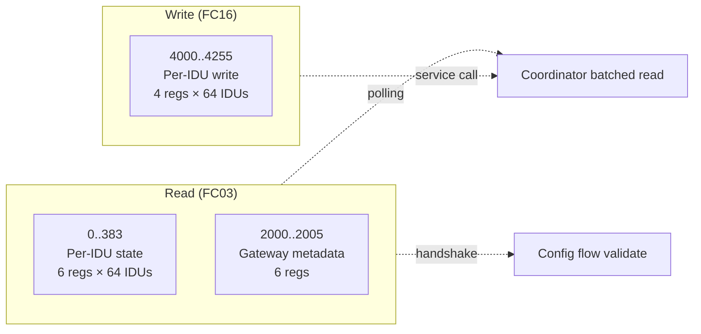

# Modbus Protocol Reference

This document freezes the wire-level behaviour of the ZhiJingLing VRV Modbus TCP gateway as consumed by the `zhijingling_vrv` integration. All addresses, encodings, and sizes here are enforced by tests in [`tests/test_const.py`](../tests/test_const.py) and [`tests/test_coordinator_parse.py`](../tests/test_coordinator_parse.py) — if the vendor changes anything, those tests are the canary.

## 1. Transport

| Setting | Value |
|---------|-------|
| Physical | Modbus TCP |
| Default port | `502` |
| Slave / device ID | `1` (rotary switch on gateway) |
| Endianness | Big-endian per Modbus TCP standard |
| Register size | 16 bits |
| Coordinator poll | Every 10 s |
| Read function | `FC03 — Read Holding Registers` |
| Write function | `FC16 — Write Multiple Registers` |

The `AsyncModbusTcpClient` from `pymodbus>=3.11.2` handles framing, retries (3 attempts, 5 s timeout each), and connection lifecycle.

## 2. Address map



### Gateway metadata block — `FC03 @ 2000` length 6

| Offset | Field | Type | Meaning |
|:------:|-------|------|---------|
| 0 | `brand` | uint16 | Vendor brand code |
| 1 | `product_type` | uint16 | VRV family / model code |
| 2 | `idu_total` | uint16 | Number of IDUs on the bus. Config flow rejects `< 1` or `> 64` |
| 3 | `temp_min` | uint16 °C | Installer-programmed lower setpoint. `0` = unset → HA falls back to `DEFAULT_MIN_TEMP` (16 °C) |
| 4 | `temp_max` | uint16 °C | Installer-programmed upper setpoint. `0` = unset → HA falls back to `DEFAULT_MAX_TEMP` (30 °C) |
| 5 | `_reserved` | uint16 | Reserved by vendor — read and discarded |

### Per-IDU read block — `FC03 @ 0 + 6·N` (stride 6, N = 0..63)

| Offset | Field | Type | Encoding |
|:------:|-------|------|----------|
| 0 | `on_off` | uint16 | `0` = off, `1` = on |
| 1 | `mode` | uint16 | `1` = heat, `2` = cool, `4` = fan_only, `8` = dry |
| 2 | `set_temp` | uint16 °C | Target temperature |
| 3 | `fan_speed` | uint16 | `0` = auto, `1` = low, `2` = medium, `3` = high |
| 4 | `room_temp` | int16 °C | Signed — two's complement decode |
| 5 | `fault_code` | uint16 | `0` = healthy, non-zero = vendor-defined fault |

### Per-IDU write block — `FC16 @ 4000 + 4·N` (stride 4, N = 0..63)

| Offset | Field | Type | Encoding |
|:------:|-------|------|----------|
| 0 | `on_off` | uint16 | `0`/`1` |
| 1 | `mode` | uint16 | Same table as read |
| 2 | `set_temp` | uint16 °C | Bounded by gateway `temp_min` / `temp_max` if non-zero |
| 3 | `fan_speed` | uint16 | Same table as read |

`room_temp` and `fault_code` are read-only — no write path.

## 3. Batched read strategy

`FC03` supports up to 125 registers per request. With 6 regs/IDU, 15 IDUs = 90 registers fits comfortably. The coordinator therefore does 5 reads per poll cycle:

```mermaid
gantt
    dateFormat  X
    axisFormat  reg %L
    title Poll cycle FC03 reads (byte offsets)

    section Batch 0 (IDU 0-14)
    90 regs @ 0     :a1, 0, 90
    section Batch 1 (IDU 15-29)
    90 regs @ 90    :a2, 90, 90
    section Batch 2 (IDU 30-44)
    90 regs @ 180   :a3, 180, 90
    section Batch 3 (IDU 45-59)
    90 regs @ 270   :a4, 270, 90
    section Batch 4 (IDU 60-63)
    24 regs @ 360   :a5, 360, 24
    section Metadata
    6 regs @ 2000   :a6, 480, 6
```



At 10 s cadence this is 6 FC03 requests per poll or **~36 req/min** — well within Modbus TCP throughput and gateway CPU budget.

## 4. Encoding tables

Defined in `const.py`:

```python
MODE_HA_TO_DEVICE = {
    HVACMode.HEAT:     1,
    HVACMode.COOL:     2,
    HVACMode.FAN_ONLY: 4,
    HVACMode.DRY:      8,
}
FAN_HA_TO_DEVICE = {
    FAN_AUTO:   0,
    FAN_LOW:    1,
    FAN_MEDIUM: 2,
    FAN_HIGH:   3,
}
```

Reverse maps (`MODE_DEVICE_TO_HA`, `FAN_DEVICE_TO_HA`) are built from these dicts — one source of truth.

### `on_off` is a separate axis

The `off` HVAC mode is expressed by `on_off = 0`, not by a distinct `mode` code. The `mode` register keeps its last value while `on_off = 0`, so when the user turns the unit back on it resumes the previous mode. `async_set_hvac_mode(OFF)` writes `on_off=0` only; `async_set_hvac_mode(COOL)` writes `on_off=1, mode=2`.

## 5. Online heuristic

The gateway happily returns `0` for every register of an unpopulated IDU slot, so the integration filters:

```python
def _is_online(on_off, room_temp, fault_code) -> bool:
    return room_temp != 0 or on_off != 0 or fault_code != 0
```

Rationale:

- `room_temp != 0` — any real IDU with a working sensor reads non-zero (even in cold rooms)
- `on_off != 0` — a powered-on IDU counts as online regardless of temp
- `fault_code != 0` — a faulted IDU is still "there"; we want it visible so users see the fault

If all three are zero, the IDU is treated as **empty slot** — no entity is created, and `sensor.idus_online` is decremented.

## 6. Write semantics

Writes are always the **full 4-register payload**. The coordinator merges the caller's requested changes with the last known `IduState` and writes back all four fields together. This avoids the risk of the gateway rejecting a partial write, and keeps state coherent when two automations change adjacent fields close in time.

```python
payload = [
    on_off    if on_off    is not None else current.on_off,
    mode      if mode      is not None else current.mode,
    set_temp  if set_temp  is not None else current.set_temp,
    fan_speed if fan_speed is not None else current.fan_speed,
]
```

After a successful write, `async_refresh()` triggers an immediate poll so the entity state in HA reflects the change without waiting for the next 10 s tick.

## 7. Error taxonomy

| Where | Exception | HA-visible symptom |
|-------|-----------|-------------------|
| `_read` | `UpdateFailed("Modbus read 2000+6 failed: ...")` | Entities → `unavailable` |
| `_read` in batch | `UpdateFailed("Modbus read N+90 failed: ...")` | Entities → `unavailable` |
| `async_write_idu` — cache miss + offline | `HomeAssistantError("IDU N offline; cannot write")` | Service call error toast |
| `async_write_idu` — FC16 error | `HomeAssistantError("Modbus write ADDR failed: ...")` | Service call error toast |
| `climate.async_set_temperature` — mode `FAN_ONLY` | `ServiceValidationError("Cannot change setpoint while in FAN_ONLY mode")` | Service call error toast |
| `climate.async_set_fan_mode` — mode `DRY` | `ServiceValidationError("Cannot change fan while in DRY mode")` | Service call error toast |
| `climate.async_set_hvac_mode` — unknown mode | `ServiceValidationError("Unsupported mode: ...")` | Service call error toast |
| `climate.async_set_fan_mode` — unknown fan | `ServiceValidationError("Unsupported fan mode: ...")` | Service call error toast |

## 8. Register enable

Modbus TCP must be enabled on the gateway before HA can talk to it. Via the gateway's built-in Chinese Web UI:

> **菜单 → 网络 → 网络协议 → 選 `MODBUS-TCP` → 儲存 → 重新啟動閘道**

Confirm the slave-ID rotary switch is `1` unless you deliberately changed it. IDU addresses are assigned by installer during commissioning and are sequential starting at slot `0` internally (which becomes IDU 1 in the UI).

---

Cross-refs: [`architecture.md`](architecture.md) · [`installation.md`](installation.md) · [`../tests/test_const.py`](../tests/test_const.py)
